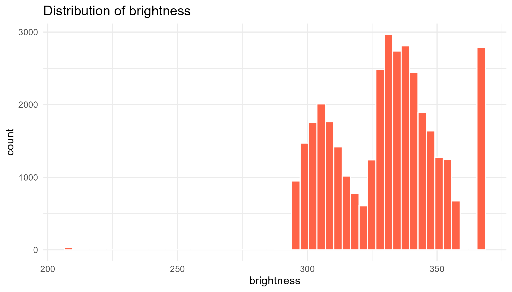
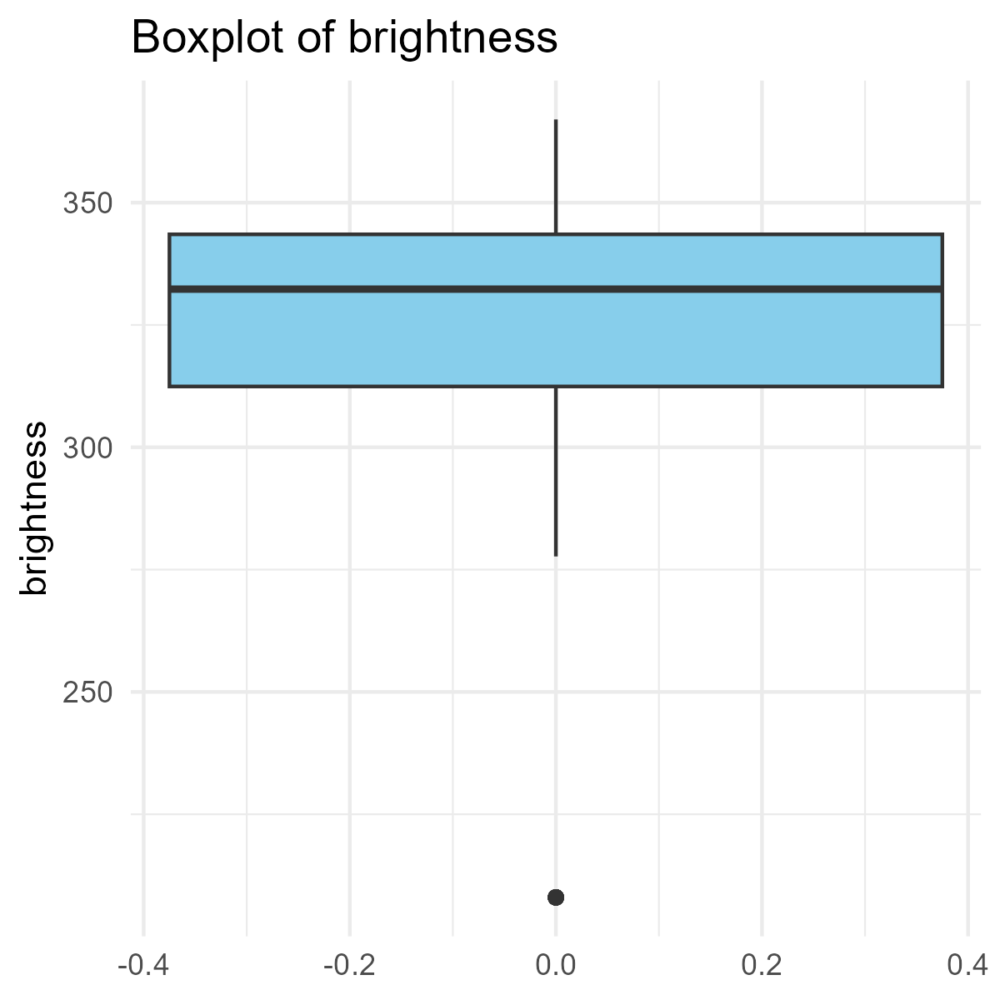
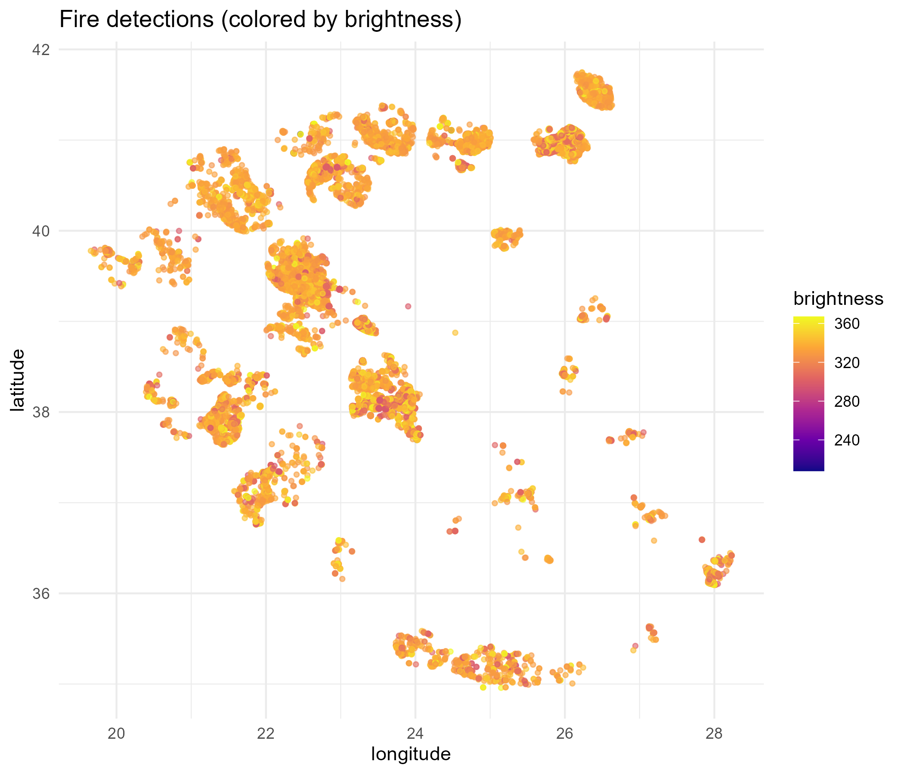
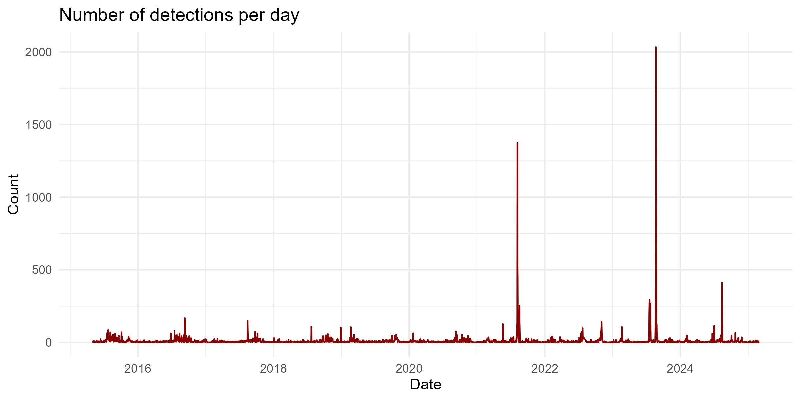
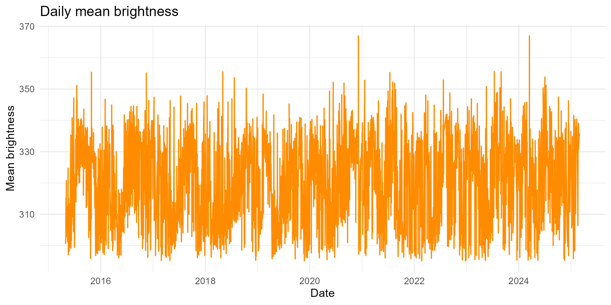
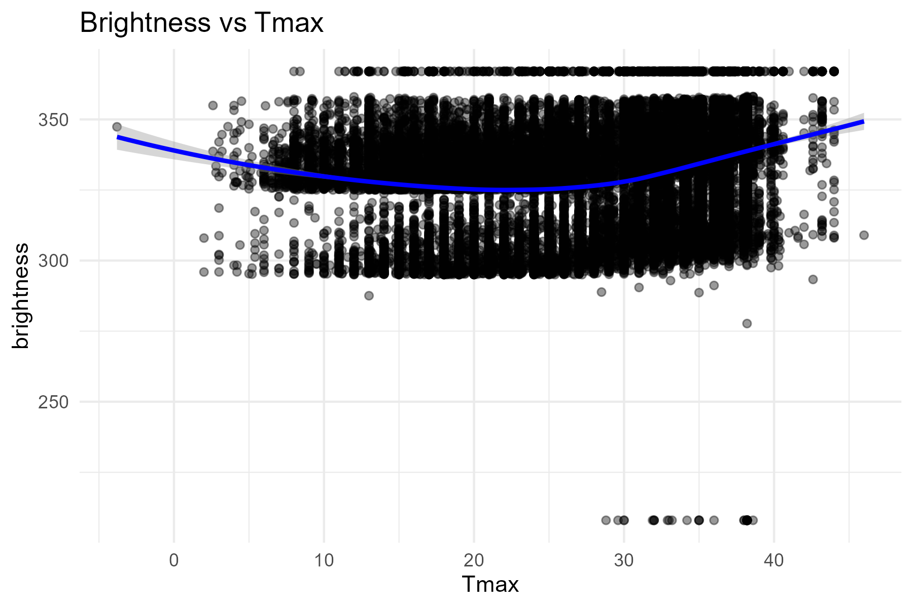

## Overview {.smaller}

This presentation analyzes fire detection data combining:

- **Satellite fire observations** (brightness, FRP, confidence)
- **Spatial coordinates** (latitude, longitude)
- **Weather variables** (temperature, precipitation, wind speed)

**Goal:** Understand fire patterns and their relationship with environmental conditions.

---

## Data Features {.smaller}

:::: {.columns}

::: {.column width="50%"}
**Fire Detection:**

- `brightness` - Thermal intensity (Kelvin)
- `scan/track` - Pixel dimensions
- `confidence` - Detection reliability (%)
- `frp` - Fire Radiative Power (MW)
- `acq_date` - Acquisition date
:::

::: {.column width="50%"}
**Weather Variables:**

- `tavg` - Average temperature
- `tmin/tmax` - Min/max temperature
- `prcp` - Precipitation
- `wspd` - Wind speed
:::

::::

---

## Distribution of Brightness

```{r}
#| echo: false
#| fig-align: center
#| out-width: "85%"

```

Most fire detections show brightness between 300-350K, with some extreme values above 360K.

---

## Brightness Summary Statistics

```{r}
#| echo: false
#| fig-align: center
#| out-width: "60%"

```

The boxplot reveals a concentrated distribution with minimal outliers on the lower end.

---

## Spatial Distribution

```{r}
#| echo: false
#| fig-align: center
#| out-width: "90%"

```

Fire hotspots clustered across the study region, with brightness intensity shown by color gradient.

---

## Temporal Pattern: Detection Counts

```{r}
#| echo: false
#| fig-align: center
#| out-width: "100%"

```

Significant spikes in fire activity during 2021 and 2024, indicating seasonal patterns.

---

## Temporal Pattern: Mean Brightness

```{r}
#| echo: false
#| fig-align: center
#| out-width: "100%"

```

Daily mean brightness remains relatively stable (310-350K) with occasional peaks above 365K.

---

## Fire-Weather Relationship

```{r}
#| echo: false
#| fig-align: center
#| out-width: "85%"

```

Non-linear relationship: brightness shows a U-shaped pattern with maximum temperature.

---

## Key Findings {.smaller}

1. **Brightness Distribution**: Most detections between 300-350K with median ~332K
2. **Temporal Patterns**: Clear seasonal spikes in fire activity (2021, 2024)
3. **Spatial Clustering**: Distinct fire hotspots across the region
4. **Weather Correlation**: Complex non-linear relationship with temperature
5. **Data Quality**: High confidence detections with minimal missing values

---

## Methodology {.smaller}

**Data Processing:**

- Cleaned and validated satellite fire observations
- Merged with daily weather data (temperature, precipitation, wind)
- Temporal aggregation by acquisition date
- Spatial mapping using lat/lon coordinates

**Analysis Tools:**

- R packages: `tidyverse`, `ggplot2`, `lubridate`, `leaflet`
- Statistical summaries and correlation analysis
- Time series visualization
- Interactive spatial mapping

---

## Next Steps {.smaller}

**Recommended Further Analysis:**

- Seasonal decomposition of fire activity patterns
- Predictive modeling using weather variables
- Land cover classification integration
- Multi-year trend analysis and change detection
- Risk zone identification for fire management

---

## Thank You

**Questions?**

For more details, see:

- Full analysis script: `analysis_fire.R`
- Interactive map: `outputs/interactive_map.html`
- Summary statistics: `outputs/summary_stats.csv`